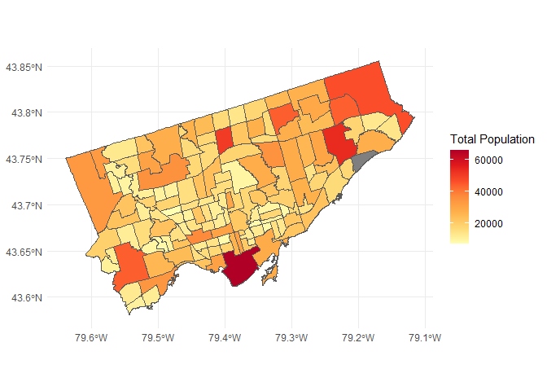
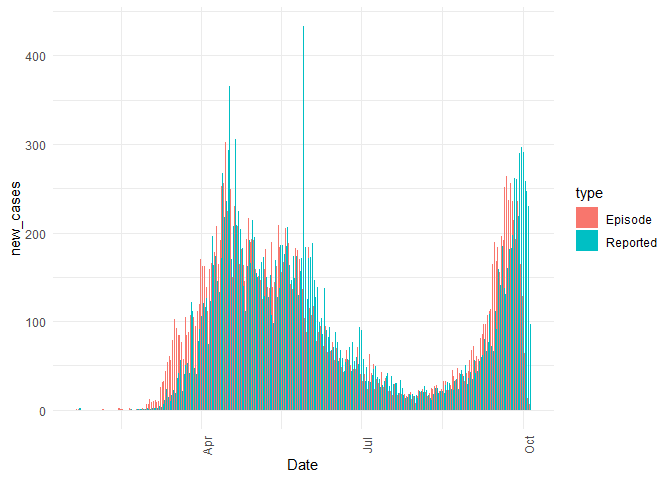
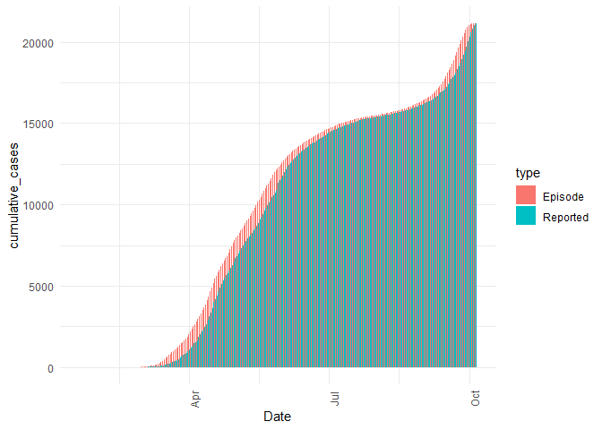
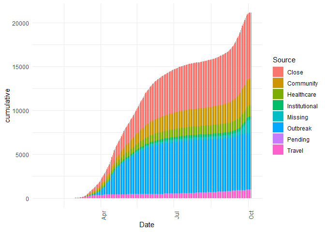

<!-- README.md is generated from README.Rmd. Please edit that file -->

# Transition probabilities of COVID-19 levels of incidence in Toronto’s neighbourhoods

<!-- badges: start -->

<!-- badges: end -->

Antonio Paez (McMaster University)

Note that I am conducting this research project *live* and the
repository will be updated to reflect progress until the final paper.

## Abstract

The objective of this analysis is to investigate the spatio-temporal
variations of incidence of COVID-19 in the neighbourhoods in Toronto.
The neighbourhoods are relatively small, ad-hoc geographic areas used
for administrative purposes in Toronto, and therefore provide a
relatively high resolution spatial perspective of the process of
diffusion of COVID-19 in Toronto. Use of spatial Markov Chains can help
to track the transition probabilities of the neighbourhoods by level of
incidence as a spatially conditioned process. The key hypothesis is that
during lockdown, with a reduction in

## Keywords

COVID-19  
Spatial analysis  
Spatial Markov Chains  
Contagion  
Toronto  
Reproducible research

## Background

I have been invited to submit a paper for a special issue of Scienze
Regionali (the journal of AISRe - Italian Association of Regional
Sciences) on the topic of COVID-19. My initial idea was to do some work
using spatial statistics to detect clusters of incidence. Eric Delmelle
and his colleagues have done some interesting work using [scan
statistics](https://www.sciencedirect.com/science/article/abs/pii/S0143622820303039).
I thought that there was an interesting effect of scale: research using
scan statistics has happened at relatively large scales (e.g., [counties
in the
US](https://www.sciencedirect.com/science/article/pii/S1877584520300320);
[municipalities in
Brazil](https://www.medrxiv.org/content/10.1101/2020.06.14.20131102v1)).

After finding the data with cases in Toronto in the Toronto Open Data
Portal, I thought that it might be more interesting to try something at
a smaller scale-higher resolution. The data for Toronto (which has been
one of the hotspots in Ontario) is for individual cases and
time-stamped. Geocoding is at the level of the “neighbourhood”, an
ad-hoc subdivision in Toronto, much smaller than a municipality. Instead
of scan statistics for detecting hotspots, I thought to use spatial
Markov Chains to examine the transition probabilities of the level of
incidence in the neighborhoods, in particular from the lockdown.

Spatial Markov Chains were proposed by Rey
[2001](https://doi.org/10.1111/j.1538-4632.2001.tb00444.x) for the
analysis of economic growth and convergence, but can be used for any
process of growth and/or convergence that is spatially conditioned (see
for instance Schettini et al.,
[2011](https://doi.org/10.1177/0160017611403141) for an application to
efficiency in manufacturing in Brazil). COVID-19, as a contagious
disease, is an obvious example of a process of growth that is spatially
conditioned. There is circumstantial evidence that lockdown policies
reduced the contagion process in Spain (Paez et al., [2020]()), although
at a relatively large level of aggregation (provinces). Therefore, it
would be interesting to investigate the evolution of the incidence of
COVID-19 as a spatially conditioned process.

Conceptually, this is what the process would look like:

1.  Initial cases are imported (they do not generate internally). The
    starting point of the cases is not necessarily random. Since they
    are associated with travel, they will depend to some extent on
    socio-economic and demographic factors (initial cases were imported
    from China, the US, or Europe - traveling might indicate relatively
    high socio-economic status, and/or ethnic links to those regions).
    From the purpose of the current analysis, we will just assume that
    the location of the initial cases is a historical contingency.

2.  As the number of cases grows public health measures are instituted.
    I will think of two broad classes of public health measures: travel
    bans, meant to reduce the risk of importing new cases, and lock-down
    measure, meant to reduce the risk of community transmission.

An examination of imported cases (related to travel) will be informative
with respect to the effectiveness of travel bans. Examination of the
transition probabilities will be informative with respect to the
effectiveness of lockdown measures.

## Preliminaries

I downloaded the following files from Toronto [Open Data
Portal](https://open.toronto.ca/) (all files were retrieved on October
9, 2020):

1.  `COVID 19 cases.csv` (search term: “covid”)

2.  `wellbeing-toronto-population-total-2011-2016-and-age-groups-2016.xlsx`
    (search term: “wellbeing demographics”)

3.  `Neighbourhoods.shp` (search term: “neighbourhoods boundaries”)

I begin by reading the files. These are the packages that I will use:

``` r
library(lubridate)
library(readr)
library(readxl)
library(sf)
library(tidyverse)
```

Read csv file with information about COVID-19 and convert dates to date
format:

``` r
covid19_cases <- read_csv("COVID19 cases.csv", 
                          col_types = cols(
                            `_id` = col_double(),
                            Assigned_ID = col_double(),
                            `Outbreak Associated` = col_character(),
                            `Age Group` = col_character(),
                            `Neighbourhood Name` = col_character(),
                            FSA = col_character(),
                            `Source of Infection` = col_character(),
                            Classification = col_character(),
                            `Episode Date` = col_character(),
                            `Reported Date` = col_character(),
                            `Client Gender` = col_character(),
                            Outcome = col_character(),
                            `Currently Hospitalized` = col_character(),
                            `Currently in ICU` = col_character(),
                            `Currently Intubated` = col_character(),
                            `Ever Hospitalized` = col_character(),
                            `Ever in ICU` = col_character(),
                            `Ever Intubated` = col_character())) %>%
  mutate(`Episode Date` = parse_date_time(`Episode Date`, orders = "mdy"),
         `Reported Date` = parse_date_time(`Reported Date`, orders = "mdy"))
```

Notice that there are two different dates in this file: `Episode Date`
and `Reported Date`. These are defined as follows:

  - `Episode Date`: The episode date is a derived variable that best
    estimates when the disease was acquired, and refers to the earliest
    available date from: symptom onset (the first day that COVID-19
    symptoms occurred), laboratory specimen collection date, or reported
    date.

  - `Reported Date`: The date on which the case was reported to Toronto
    Public Health.

There is expected to be an occasional lag between the episode and the
report.

The Source of Infection is a variable that describes “The most likely
way that sporadic cases acquired their COVID-19 infection. Only the most
likely exposure for each case is reported. Exposures that occurred up to
14 days before symptoms start are potential acquisition sources.” The
sources of infaction are:

  - Travel: Travel outside of Ontario.

  - Close contact with a case: Was in close contact with a confirmed or
    probable COVID-19 case (e.g., reside in the same household).

  - Institutional setting: Institutional settings includes, but not
    limited to: long-term care homes, acute care hospitals, complex case
    hospitals, special care facilities, retirement homes, rehabilitation
    hospitals.

  - Healthcare setting: Healthcare settings includes, but not limited
    to: family physician, dentist, ophthalmologist, sports doctor.

  - Community: Cases with no reported travel outside of Ontario, no
    known close contact with a COVID-19 case, and no reported infection
    acquired in an institutional or healthcare setting.

  - Pending Information on source of infection pending.

  - Unknown/missing Source of infection not identified or missing.

  - N/A: Outbreak-associated cases.

How many cases have been associated with each source of infection?

``` r
table(covid19_cases$`Source of Infection`)
#> 
#>             Close contact                 Community                Healthcare 
#>                      7510                      3045                      1256 
#>             Institutional N/A - Outbreak associated                   Pending 
#>                       366                      6474                        40 
#>                    Travel           Unknown/Missing 
#>                       913                      1538
```

Despite travel not being the most common source of infection, close
contact with those who traveled is the major source of infection. This
is followed by “Outbreak associated”. Need to find more precisely what
that means.

Read xlsx file with demographic information and rename column for total
population:

``` r
toronto_population <- read_excel("wellbeing-toronto-population-total-2011-2016-and-age-groups-2016.xlsx",
                                 sheet = "2016_Age Groups") %>% 
  rename(total_population = `Total Population - All Age Groups - 100% data`)
```

Read shape file and rename columns:

``` r
neighbourhoods <- st_read("Neighbourhoods.shp") %>%
  rename(`_id` = FIELD_1,
          AREA_ID = FIELD_2,
          AREA_ATTR_ID = FIELD_3,
          PARENT_AREA_ID = FIELD_4,
          AREA_SHORT_CODE = FIELD_5,
          AREA_LONG_CODE = FIELD_6,
          AREA_NAME = FIELD_7,
          AREA_DESC = FIELD_8,
          X = FIELD_9,
          Y = FIELD_10,
          LONGITUDE = FIELD_11,
          LATITUDE = FIELD_12,
          OBJECTID = FIELD_13,
          Shape__Area = FIELD_14,
          Shape__Length = FIELD_15)
#> Reading layer `Neighbourhoods' from data source `C:\Antonio\Cases 2020\COVID-19-Toronto-Spatial\Neighbourhoods.shp' using driver `ESRI Shapefile'
#> Simple feature collection with 140 features and 15 fields
#> geometry type:  POLYGON
#> dimension:      XY
#> bbox:           xmin: -79.63926 ymin: 43.581 xmax: -79.11545 ymax: 43.85546
#> geographic CRS: WGS 84
```

## Exploratory data analysis

The keys to joining the demographic data to the neighbourhood boundaries
are the NeighbourhoodID (in the demographic data frame) and
AREA\_SHORT\_CODE (in the boundaries data frame). Convert those columns
to character:

``` r
toronto_population <- toronto_population %>%
  mutate(NeighbourhoodID = as.character(NeighbourhoodID))

neighbourhoods <- neighbourhoods %>%
  mutate(AREA_SHORT_CODE = as.character(AREA_SHORT_CODE))
```

It is now possible to join the demographic data to the boundaries:

``` r
 neighbourhoods <- neighbourhoods %>%
  left_join(toronto_population, by = c("AREA_SHORT_CODE" = "NeighbourhoodID"))
```

Plot population by neighbourhood:

``` r
ggplot(data = neighbourhoods) +
  geom_sf(aes(fill = total_population)) + 
  scale_fill_distiller(name = "Total Population",
                       palette = "YlOrRd", 
                       direction = 1) +
  theme_minimal()
```

<!-- -->

To calculate the number of cases by episode date, we summarize the data
frame as follows:

``` r
covid19_cases_by_episode <- covid19_cases %>%
  group_by(`Episode Date`) %>%
  summarize(new_cases = n(), 
            .groups = "drop") %>%
  rename(Date = `Episode Date`)
```

To calculate the number of cases by reported date, we summarize the data
frame as follows:

``` r
covid19_cases_by_report <- covid19_cases %>%
  group_by(`Reported Date`) %>%
  summarize(new_cases = n(), 
            .groups = "drop") %>%
  rename(Date = `Reported Date`)
```

The cumulative number of new cases (by episode and reported dates) can
be calculated using the function `lag()`:

``` r
covid19_cases_by_episode <- covid19_cases_by_episode %>%
  mutate(cumulative_cases = cumsum(new_cases),
         type = "Episode")

covid19_cases_by_report <- covid19_cases_by_report %>%
  mutate(cumulative_cases = cumsum(new_cases),
         type = "Reported")
```

Bind these two data frames for visualization:

``` r
covid19_cases_by <- rbind(covid19_cases_by_episode, 
                          covid19_cases_by_report)
```

Plot the number of new cases:

``` r
ggplot(data = covid19_cases_by, 
       aes(x = Date, 
           y = new_cases, 
           fill = type)) +
  geom_col(position = "dodge") +
  theme_minimal() + 
  theme(axis.text.x = element_text(angle = 90))
```

<!-- -->

We see the peak of the first wave of the pandemic in Toronto in the
winter-spring 2020, and the early stages of the second wave at the end
of the summer, beginning of the fall.

Plot the cumulative number of cases by date:

``` r
ggplot(data = covid19_cases_by, 
       aes(x = Date, 
           y = cumulative_cases, 
           fill = type)) +
  geom_col(position = "dodge") +
  theme_minimal() + 
  theme(axis.text.x = element_text(angle = 90))
```

<!-- -->

The lag between the episode and report was relatively small in the
summer, but started increasing again at the end of the summer and
beginning of the fall.

The cumulative incidence can be calculated by dividing the cumulative
cases by the total population (this is in cases per million people):

``` r
covid19_cases_by <- covid19_cases_by %>%
  mutate(cumulative_incidence = cumulative_cases/(sum(toronto_population$total_population, na.rm = TRUE)/1000000))
```

The distribution of the cumulative incidence is as follows:

``` r
summary(covid19_cases_by$cumulative_incidence)
#>     Min.  1st Qu.   Median     Mean  3rd Qu.     Max. 
#>    0.367 1713.406 4956.127 3922.075 5725.929 7768.567
```

For context, according to
[worldometer](https://www.worldometers.info/coronavirus/) the total
cases per million population in various countries is (as of October 10,
2020):

  - USA: 23,960 cass per million

  - Brazil: 23,908 cases per million

  - Spain: 19,041 cases per million

  - Italy: 5,783 cases per million

  - Canada: 4,762 cases per million

What is the temporal distribution of cases by source of infection? To
explore this we need to summarize the data frame now by date and source
of infection. I’ll do this only by date of episode:

``` r
covid19_cases_by_source <- covid19_cases %>%
  group_by(`Episode Date`, 
           `Source of Infection`) %>%
  summarize(new_cases = n(),
            .groups = "drop") %>%
  rename(Date = `Episode Date`)
```

Now the cumulative sums need to be calculated separately for each source
of infection. To do this I pivot the table wider:

``` r
covid19_cases_by_source_wide <- covid19_cases_by_source %>%
  pivot_wider(names_from = `Source of Infection`,
              names_prefix = "new_",
              values_from = new_cases,
              values_fill = 0) %>%
  rename(new_Close = `new_Close contact`,
         new_Outbreak = `new_N/A - Outbreak associated`,
         new_Missing = `new_Unknown/Missing`)
```

The wider table makes it convenient to calculate the cumulative number
of cases by source of infection:

``` r
covid19_cases_by_source_wide <- covid19_cases_by_source_wide %>%
  mutate(cumulative_Travel = cumsum(new_Travel),
         cumulative_Community = cumsum(new_Community),
         cumulative_Close = cumsum(new_Close),
         cumulative_Healthcare = cumsum(new_Healthcare),
         cumulative_Outbreak = cumsum(new_Outbreak),
         cumulative_Institutional = cumsum(new_Institutional),
         cumulative_Pending = cumsum(new_Pending),
         cumulative_Missing = cumsum(new_Missing))
```

For visualization, I prefer to pivot to long again so that I can use
aesthetics and facets:

``` r
junk <- covid19_cases_by_source_wide %>%
  pivot_longer(!Date,
               names_to = c(".value", "Source"),
               names_sep = "_")
```

``` r
ggplot(data = junk, aes(x = Date, 
                        y = cumulative, 
                        fill = Source)) +
  geom_col(position = "stack") +
  theme_minimal() + 
  theme(axis.text.x = element_text(angle = 90))
```

<!-- -->
